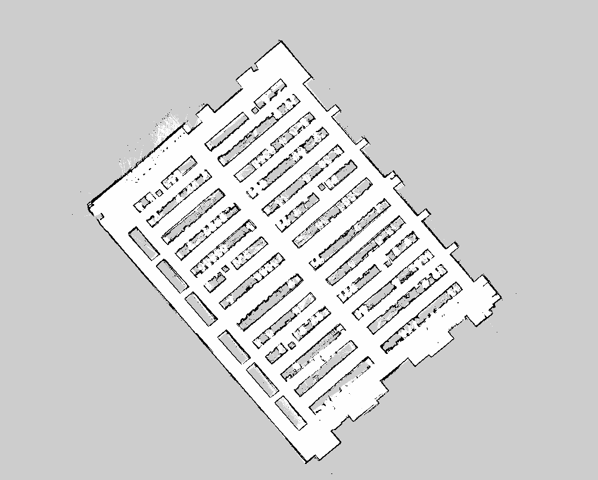
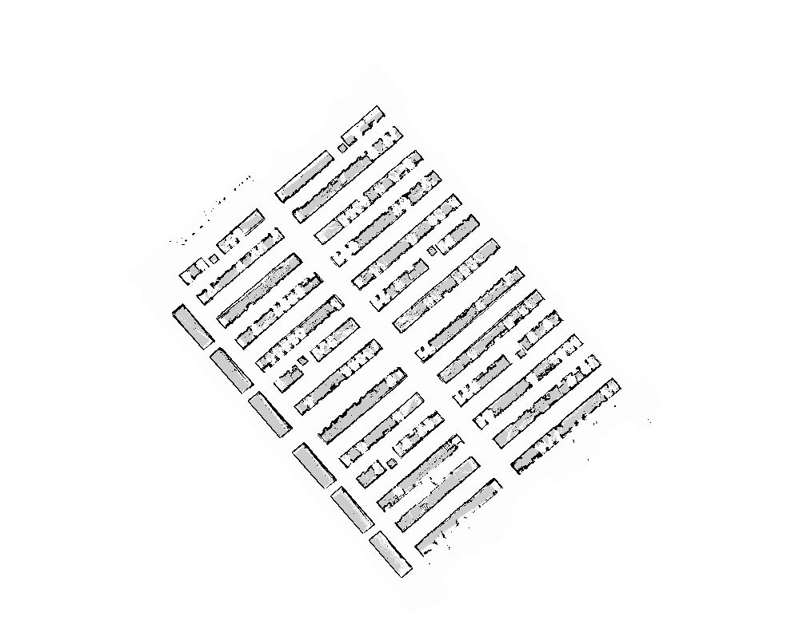
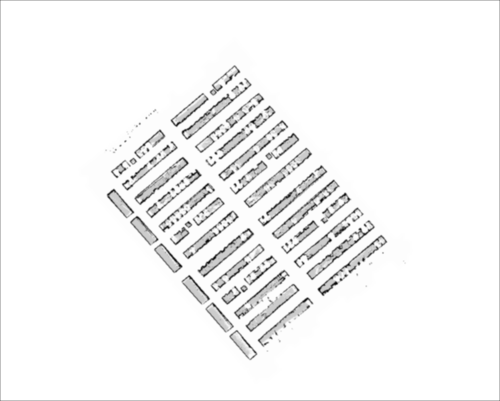
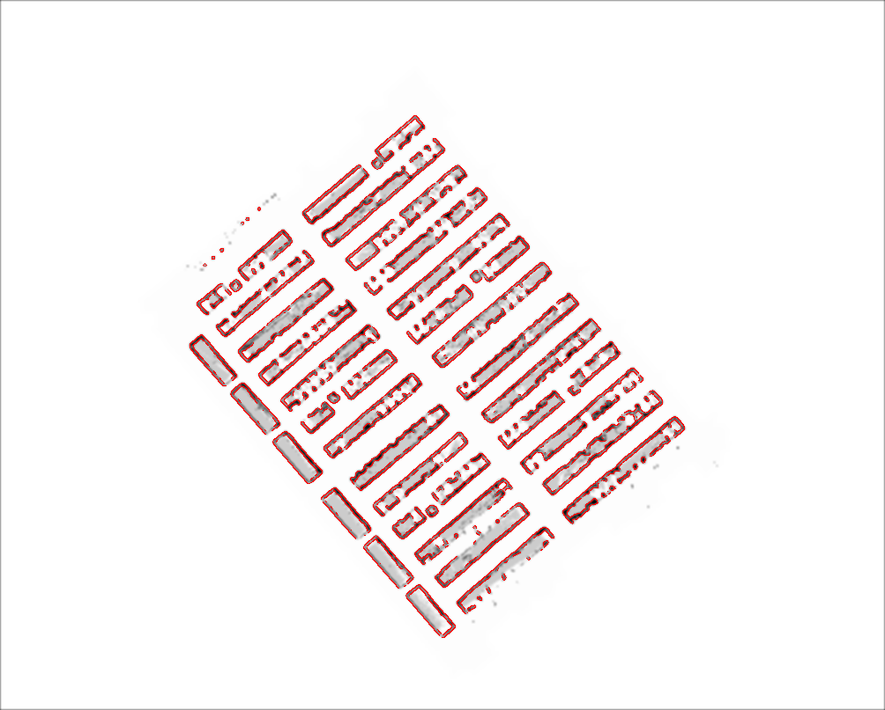
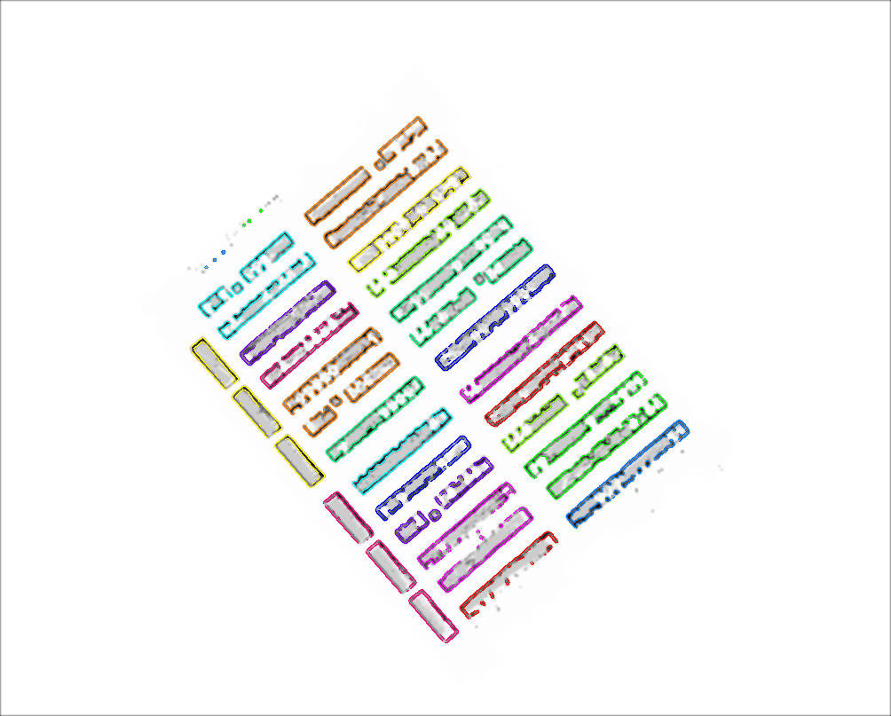
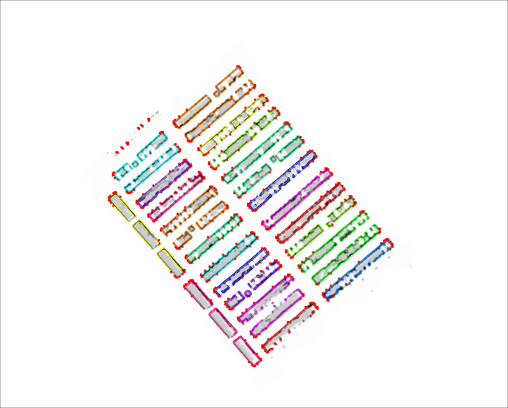

# Autoko

This is the fetchcore autokeepout annotation package.

## Algorithm

We begin with an original PNG image.

### Flood Fill & Pixel Dilation

### Gaussian Blur

### Edge Detection

### Clustering

### Convex Hull

